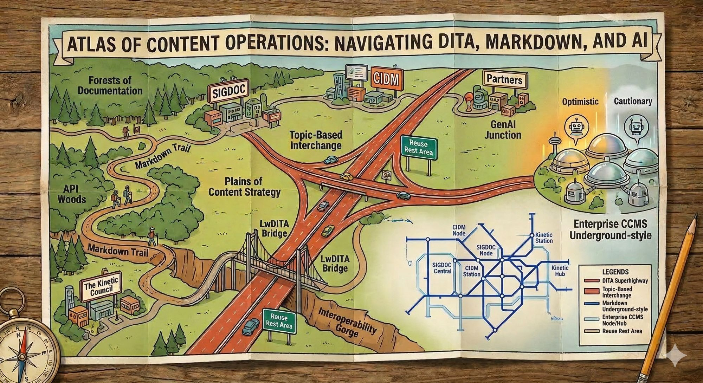

# Navigating ContentOps, DITA, Markdown, and AI: A ConVEx Atlas

**ConVEx Pittsburgh · Monday, April 13, 2026 · 10:30–11:15 AM**

---

**Carlos Evia** · Professor, Associate Dean, and CTO; College of Liberal Arts and Human Sciences, Virginia Tech  
**Rebekka Andersen** · Associate Professor; University of California, Davis

---

---

## About This Session

Where are you on your content operations journey? This session presents a cartographic framework for navigating the overlapping territories of structured authoring (DITA), lightweight formats (Markdown, LwDITA), AI-assisted workflows, and content operations at scale. Rather than prescribing a single "right" path, we offer an atlas —a set of maps showing different terrain, trade-offs, and routes depending on where your organization is starting from and where it needs to go.

---

## The Atlas Metaphor

Atlases don't tell you where to go. They show you the territory so you can choose your own route.

In this session, we use the atlas metaphor to help you navigate the ConVEx conference to gather resources and ideas that you can take home and implement in your professional workflows. We also aim to introduce you to key figures in the specific content domains at the center of this event and the CIDM community.

---

## Keys to the Atlas

1. **DITA and Markdown are not competitors; they are different maps of the same territory.** The meaningful question is not "DITA or Markdown?" but "at what scale, for what audience, with what tooling?"

2. **AI is a new kind of traveler on the content atlas** — one that reads formats literally, rewards structured semantics, and introduces what we call *intentio algorithmi*: the interpretive force that AI systems exert on content as they process, transform, and generate it.

3. **ContentOps is the infrastructure layer beneath the maps** — governance, pipelines, and metadata standards that determine whether any content strategy is sustainable.

4. **Lightweight DITA (LwDITA) is a border crossing** — a formally specified interface between the DITA ecosystem and Markdown/HTML workflows, not a simplification of DITA.

---

## Contact

Questions after the session? Reach us at:

- Carlos Evia · [cevia@vt.edu](mailto:cevia@vt.edu), Virginia Tech
- Rebekka Andersen · [randersen@ucdavis.edu](mailto:randersen@ucdavis.edu), University of California, Davis.

*This handout is an open, versioned document. If you find an error or want to suggest a revision, open an issue or pull request on [GitHub](https://github.com/vt-evia/convex-atlas-handout).*
